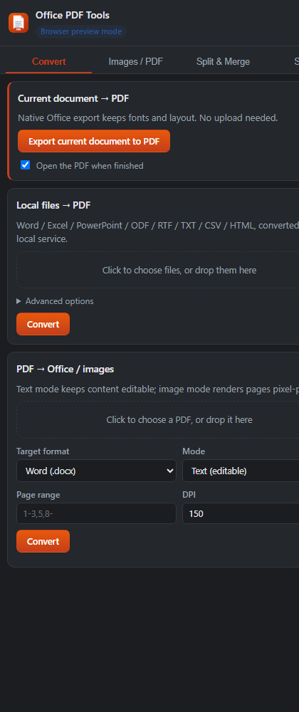

# Office PDF 工具 · office-pdf-tools

> 一个 Office 加载项（Word / Excel / PowerPoint 共用一份清单）+ 一个本地 Node 服务，
> 把 **Office ⇄ PDF**、**图片 ⇄ PDF**、**文档拆分合并** 全部收进 Office 功能区。

<p align="center">
  
</p>

<p align="left">
  <a href="https://github.com/ZizzSaint/office-pdf-tools/actions/workflows/ci.yml"></a>
  
  
  
  
</p>

---

## 功能一览

| 分类 | 功能 | 说明 |
| --- | --- | --- |
| **基础** | **当前文档 → PDF** | 调用 Office 原生导出（`getFileAsync(FileType.Pdf)`），字体、分页、图表完全保真，不上传、秒级完成 |
| 附加 1 | 本地文件 → PDF | 服务端引擎批量转换：Word / Excel / PowerPoint / ODF / RTF / TXT / CSV / HTML |
| 附加 1 | PDF → Word / Excel / PowerPoint | 两种模式：**文本模式**（可编辑，重排标题/段落/表格）与**图片模式**（逐页渲染，版式 100% 保真） |
| 附加 1 | PDF → 图片 | PNG / JPEG / WebP，可选 DPI（36–1200）与页码范围，多页自动打包 ZIP |
| 附加 1 | 图片 → PDF | PNG / JPG / WebP / GIF / BMP / TIFF，可排序、可设页面尺寸/方向/边距/每页张数（1/2/4/6/9 宫格）、可每图单独成 PDF |
| 附加 2 | 拆分 | PDF：每 N 页 / 页码范围 / 每页；Word：按标题级别 / 按分节符；Excel：按工作表 / 每 N 行；PowerPoint：每 N 张 / 幻灯片范围。结果 ZIP 打包 |
| 附加 2 | 合并 | PDF 逐页拼接；Word 追加正文（含图片、样式、编号）；Excel 汇总工作表；PowerPoint 追加幻灯片（连同版式母版） |
| 体验 | 结果处理 | 直接下载、写入输出目录、一键打开文件/所在文件夹；`.docx`/`.pptx` 结果可**插入回当前文档**（Word 1.5+ / PowerPoint 1.2+） |
| 体验 | 双语文案 | 任务窗格中英自动切换（跟随 Office 语言，可手动切换） |

## 界面

| 转换 | 拆分合并 |
| --- | --- |
| 当前文档导出、本地文件批量转 PDF、PDF 转 Office/图片 | 多文件合并（可拖动排序）、按页/标题/工作表/幻灯片拆分 |

功能区入口：安装后 Word / Excel / PowerPoint 都会多出一个 **“PDF 工具”** 选项卡，内含「导出 PDF」「PDF 转换」「拆分合并」三个按钮，点击即打开对应面板。

## 工作原理

```
┌─────────────────────────── Office (Word/Excel/PowerPoint) ───────────────────────────┐
│  功能区“PDF 工具”  ──►  任务窗格 (addin/, Office.js)                                  │
│      ├─ 当前文档 → PDF：Office 原生导出，直接把 PDF 交给本地服务保存                    │
│      └─ 其它功能：把文件 POST 到 http://localhost:3000/api/...                         │
└───────────────────────────────────────┬──────────────────────────────────────────────┘
                                        │ HTTPS / multipart
┌───────────────────────────────────────▼──────────────────────────────────────────────┐
│  本地服务 (server/, Node + Express)                                                   │
│   ├─ 转换引擎：① Microsoft Office COM（Windows，保真度高） ② LibreOffice（跨平台）      │
│   ├─ PDF 处理：pdf-lib（合并/拆分/图片排版） + pdf.js（渲染/取字）                      │
│   ├─ Office 处理：OOXML 关系搬迁引擎（docx/pptx 合并拆分）+ ExcelJS（xlsx）             │
│   └─ 任务队列：上传 → 后台转换 → 进度轮询 → 下载 / 写入输出目录 / 打开文件夹              │
└──────────────────────────────────────────────────────────────────────────────────────┘
```

**为什么需要本地服务？** Office.js 只能把当前文档导出成 PDF，无法做“PDF 转 Word”这类反向转换，也不能读写磁盘上的任意文件。因此项目采用“加载项负责交互 + 本地服务负责重活”的经典结构，既保住了 Office 原生的排版保真度，又拿到了完整的格式转换能力。

## 快速开始

### 1. 环境要求

- **Node.js ≥ 22.13**（pdf.js 6 的硬性要求；Node 20 及更早版本无法解析 PDF）
- **Windows / macOS / Linux** 均可运行服务；Office 加载项桌面端以 Windows 为主
- **Office → PDF 引擎**（二选一，服务启动时会自动探测并在“设置”页展示）：
  - **Microsoft Office 桌面版**（Windows，推荐）：走 COM 自动化，保真度与 Office 原生导出一致
  - **LibreOffice**：跨平台，设置 `SOFFICE_PATH` 或安装到默认位置即可
- 若两者都没有：**“当前文档 → PDF”依旧可用**（由 Office 本体完成），其余 PDF 相关功能也不受影响

### 2. 安装与启动

```bash
git clone https://github.com/ZizzSaint/office-pdf-tools.git
cd office-pdf-tools
npm install
npm run https          # 启动 HTTPS 服务（首次会生成并信任本地开发证书）
```

启动后会打印：

```
[12:00:00] INFO  office-pdf-tools v1.0.0 已启动
[12:00:00] INFO    任务窗格: https://localhost:3000/taskpane.html
[12:00:00] INFO    API:      https://localhost:3000/api/health
[12:00:00] INFO    输出目录: <项目>/output
[12:00:00] INFO  engines: { libreoffice: 'no', msoffice: '已启用: word, excel, powerpoint', renderer: 'pdf.js 6.4.299 + @napi-rs/canvas' }
```

> Office 加载项**必须**通过 HTTPS 加载，所以本地服务默认就是 HTTPS；纯 API 调试可以用 `npm start`（HTTP）。

### 3. 侧载加载项

**Windows**

```bash
npm run sideload        # 写入开发者侧载注册表项
```

然后**完全退出**并重新打开 Word / Excel / PowerPoint，功能区即出现“PDF 工具”。

**其它方式 / 手动侧载 / macOS**：见 [docs/INSTALL.md](docs/INSTALL.md)。

### 4. 开始使用

在 Word / Excel / PowerPoint 中点击 **PDF 工具 → 导出 PDF**，任务窗格里：

1. **当前文档 → PDF**：点一下，PDF 立刻出现在 `output/` 目录（可直接下载或打开）
2. **本地文件 → PDF**：拖入 docx/xlsx/pptx 等，批量转换
3. **PDF → Office / 图片**：选择目标格式与模式
4. **图片 / PDF**、**拆分合并**：拖拽文件、调选项、点按钮

## npm 脚本

| 命令 | 作用 |
| --- | --- |
| `npm run https` | HTTPS 启动（Office 加载项必须；默认端口 3000） |
| `npm start` | HTTP 启动（仅 API 调试） |
| `npm run dev` | HTTPS + 关闭静态资源缓存，便于改前端 |
| `npm test` | 运行全部测试（32 项，含真实 Office/PDF 转换） |
| `npm run smoke` | 端到端冒烟：自动造样例 → 跑通 12 条链路 → 打印结果表 |
| `npm run sideload` / `unsideload` | Windows 侧载 / 取消侧载 |
| `npm run validate:manifest` | 用微软官方校验网关校验 `manifest/manifest.xml` |
| `npm run set:port -- 3001` | 修改端口并同步清单、文档、脚本中的 URL |
| `npm run gen:icons` | 重新生成 16/32/64/80/128 图标 |
| `npm run publish:github` | 把项目发布到 GitHub（见 [docs/PUBLISH.md](docs/PUBLISH.md)） |

服务参数也可用命令行/环境变量：`--port 3001`、`--host 0.0.0.0`、`--output D:\\pdf-out`、`--https`、`--dev`、`PORT`、`OUTPUT_DIR`、`MAX_UPLOAD_MB`、`SOFFICE_PATH`、`LOG_LEVEL`。

## HTTP API

服务同时是一套可独立使用的 REST API（`curl` 也能用）：

```bash
# 异步任务：上传 → 轮询 → 下载
curl -F "files=@report.docx" -F "op=office-to-pdf" http://localhost:3000/api/jobs
curl http://localhost:3000/api/jobs/<jobId>
curl -OJ http://localhost:3000/api/jobs/<jobId>/result/0

# 同步接口：直接返回结果文件
curl -o chart.pdf -F "files=@book.xlsx" -F "op=office-to-pdf" http://localhost:3000/api/jobs?sync=1
```

支持的操作：`office-to-pdf`、`pdf-to-office`、`pdf-to-images`、`images-to-pdf`、`merge`、`split`。完整参数见 [docs/API.md](docs/API.md)。

## 目录结构

```
office-pdf-tools/
├─ manifest/manifest.xml        # 一份清单同时支持 Word / Excel / PowerPoint（已通过微软官方校验）
├─ addin/                       # 任务窗格前端（原生 ES Module，无需打包）
│  ├─ taskpane.html              # 四个面板：转换 / 图片·PDF / 拆分合并 / 设置
│  ├─ js/office-bridge.js        # Office.js 桥接：宿主识别、原生导出 PDF、结果回插
│  ├─ js/api.js                  # 本地服务客户端（上传进度、任务轮询、下载）
│  └─ js/panels/*.js             # 各面板逻辑
├─ server/                      # 本地服务
│  ├─ lib/engines/               # LibreOffice / Microsoft Office COM / pdf.js 渲染
│  ├─ lib/convert/               # 四类转换实现
│  ├─ lib/ooxml/                 # OOXML 包操作、关系深拷贝、孤立部件回收
│  ├─ lib/merge|split/           # docx / xlsx / pptx / pdf 的合并与拆分
│  └─ routes/api.js              # REST 路由
├─ scripts/                     # 侧载、冒烟、发布、图标、端口等辅助脚本
├─ tests/                       # node:test 测试（32 项）
└─ docs/                        # 安装 / API / 架构 / 排错 / 发布文档
```

## 已知限制（重要）

诚实说明，避免踩坑：

- **PDF → Word 文本模式**是版式重排而非逆向还原：标题、段落、表格会被识别重建，但复杂多栏、文本框、形状、公式不保证一致；扫描件（无文本层）请用**图片模式**。
- **Word 合并**会迁移正文、表格、图片、样式定义与编号定义；**脚注、尾注、批注、修订痕迹不迁移**。
- **Excel 合并/拆分**基于 ExcelJS：单元格值、公式、常用样式、列宽、合并单元格、冻结窗格会保留；**图表、图片、数据透视表、宏不保留**。
- **PowerPoint 合并**会把源演示文稿的版式与母版一并复制（保真但体积增大），**备注页不迁移**。
- **Microsoft Office COM 引擎**需要桌面版 Office 且处于交互式会话；若有卡死的 Office 进程，自动化会失败（服务会给出明确提示）。
- **PDF → PowerPoint/Word 图片模式**产物是整页图片，观感一致但不可编辑。
- 服务默认只监听 `127.0.0.1`：这是有意为之（本机工具，避免暴露到局域网）。

## 安全设计

- 服务只绑定回环地址；API 写操作要求自定义请求头 `X-Office-Pdf-Tools`，并只接受 `localhost/127.0.0.1` 来源的跨域请求（防 CSRF / 防 DNS rebinding）。
- 上传文件存放在系统临时目录、任务结束即清理；输出统一写入 `output/`（可用 `--output` 或设置页修改），文件名做净化与去重。
- “打开文件/文件夹”接口只允许操作输出目录、临时目录与项目目录内的路径。
- 上传大小默认上限 300 MB（`MAX_UPLOAD_MB` 可调）。

## 依赖与安全审计

`npm audit` 目前会报告 7 条告警，来源与本项目的实际风险如下（均已核实依赖链）：

| 依赖链 | 级别 | 说明 |
| --- | --- | --- |
| `office-addin-dev-certs → mkcert → node-forge` | high | **仅开发期**用于生成本地 HTTPS 开发证书，不参与运行时转换 |
| `pptxgenjs → image-size` | high | 解析图片头尺寸；本项目只把**自己渲染出的 PNG** 交给它，不处理外部图片 |
| `exceljs → uuid` | moderate | ExcelJS 内部 ID 生成 |

上游尚未发布修复版本；由于服务只监听回环地址、不处理不可信网络输入，这些告警不影响本机使用。
如果你的部署会暴露到局域网，请优先把 `pptxgenjs`/`exceljs` 换成受控版本或加一层输入隔离。

## 测试

```bash
npm test
```

32 项测试覆盖：页码范围解析、PDF 版面重建（行/段落/标题/表格/列聚类）、图片↔PDF、PDF 拆分合并、Word/Excel/PowerPoint 的合并与拆分（含关系搬迁校验）、清单结构与 i18n 一致性、REST API 全流程（上传/轮询/下载/打包/CSRF）、**真实的 Office → PDF 转换**（本机有 Office 或 LibreOffice 时才执行）。

## English summary

**office-pdf-tools** is an Office Add-in (one manifest for Word, Excel, and PowerPoint) plus a local Node service:

- **Export the current document to PDF** with the native Office export (perfect fidelity, no upload).
- **Convert Office ⇄ PDF**: batch Office→PDF through Microsoft Office COM (Windows) or LibreOffice; PDF→Word/Excel/PowerPoint in *text* (editable) or *raster* (pixel-perfect) mode.
- **Images ⇄ PDF**: build PDFs from images (page size, orientation, margin, 1/2/4/6/9-up, one PDF per image) and render PDF pages to PNG/JPEG/WebP at any DPI with page ranges.
- **Split & merge**: PDF by pages/ranges; Word by heading level or section break; Excel by worksheet or N rows; PowerPoint by N slides or ranges — merged Word/PPTX documents keep images, styles, numbering, layouts, and masters.

Run `npm install && npm run https`, then `npm run sideload` on Windows, and look for the “PDF 工具” ribbon tab. The REST API on `https://localhost:3000/api` is usable standalone (see [docs/API.md](docs/API.md)).

## 许可证

[MIT](LICENSE) © 2026 ZizzSaint

---

> 本项目为独立实现，与 Microsoft 无关联；Office、Word、Excel、PowerPoint 是 Microsoft Corporation 的商标。
